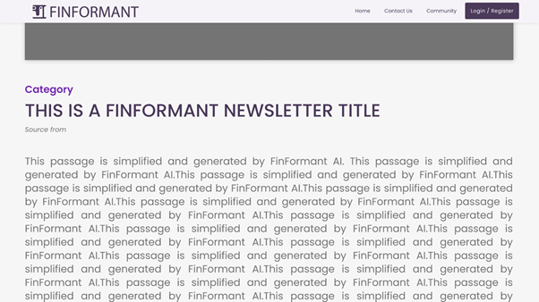
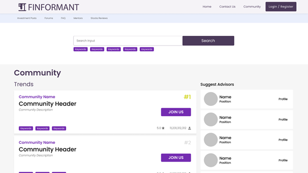
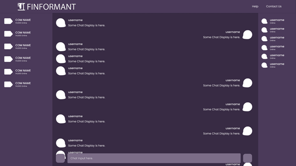

# CityHack22 Project Submission
## Project: Finformant

## Team: Capricious
## Members
- Onasis Melchior Jeyakumar (Leader)
- Lee Kai Zheng
- Pranav Gupta
- Bolisetti Sree Vamsi Krishna

## Description of the Project
Trading is currently an emerging field be it Stocks, Crypto or any other equity, and has a very high influx. To the extent of its popularity, the trading field is filled with numerous jargons and a plethora of complicated procedures. It takes almost 2 years for a hard-working trader to see the light of success, this leads to a lot of part-time/hobby traders to give up easily. Finformant is here to change this! We want to give everyone the resources and real time updates so that they can be always on their best game. 

Starting with our Newsletters which are condensed information from top websites, reports and more. With our Newsletters, we aim to give our users a channel in which they can get real time updates from different sources and at the same time, give a condensed form to make it more time efficient. A community is very important for building upcoming traders, we provide a premium community feature where the user can join any of the available community or create their own community and customize the community to fit their requirements. The users can also send direct messages to other users in the community.

To top it all, a good advisor can easily boost your trading career and fast track you to success. Finformant provides you with an Advisor recommendation feature, through which you can seek help from other successful traders. Learn from the best to beat the best. In a nutshell, Finformant not only helps professional traders to keep track of their transactions but also help beginners to master their trading skill.

## 3 Most Impactful Features of the Project
### 1. Newsletters
Trading is an environment where there are countless updates and changes every second. A highly volatile environment asks for a strategy approach that allows you to quickly go  through the strategy process in short cycles and that produces quick results. To achieve this strategy, information is of essence. This can be easily done with our newsletter service. Our newsletter service provides snippets from various online sources. This provides the user with not only the mainstream information from an individual source, but multiple perspective for the user to make their best choice. 

The newsletter in the Home/Search page are places like cards which show what category the news is from, the title of the article, the source and a short description. The user can view the card if the description or keywords is of their interest. Upon clicking the interested Newsletter, the user is shown the full view of the card where you can see the entire article/report for further analysis. The user can also up-vote or down-vote the article, which can help us in the future to know which sources or topics or keywords the user would be interested in. This feature can also be used to know which sources our users prefer and which to be avoided.

<figure class="image-caption">
  <em>Home/Search page with the Newsletters</em>
    
</figure>

<figure class="image-caption">
  <em>Newsletters when clicked</em>
    
</figure>

### 2. Community
The Community is a place where we want people to come together and share their interests and concerns. This is a premium feature and users can join any number of communities of their choice. Unlike public forums, community is a private chatroom respecting users’ privacy. The user of a community can also send direct/private messages to other community members to improve their personal network. 

A user can also host their own community, give it a name, a goal/description and let others know what their community is for. The user can also set the community to be public, where any other user can join, or private, where other users have to request the community host to join. This is a place where everyone can share the newsletters and stock news with others. 

<figure class="image-caption">
  <em>Community Recommendation/Search</em>
    
</figure>

<figure class="image-caption">
  <em>Community Chatroom</em>
    
</figure>

### 3. Advisors
This is a Mentorship program we enable with our platform. Our vision with the Advisors feature is to provide a lending hand to whoever is in need. Various Advisors can distinguish themselves with their trading portfolio or the type of trade they specialize in. This is something our beginners, and even intermediate traders can take advantage of to get a head start on the trading career. 

The users can choose an Advisor from our recommendations which will be based on mutual interest, or the users can search for their own Advisors. The search can be done in the same page as community. After their session with the Advisor, the user can add review on the Advisor and rate their experience. This helps other users to choose their best fitting Advisor. 

<figure class="image-caption">
  <em>Advisors Recommendations</em>
    
</figure>

## Tech used 
1. HTML, CSS, JS - (Prototype)
2. Google Finance API, NewsAPI - (Information Extraction)
3. FireBase - (RTDB Chatroom)
4. Figma - (High-Fidelity Prototyping)
5. Machine Learning - (PCA Analysis)

## Link
[Link to Video](https://drive.google.com/file/d/1gRjcK05aCZBx-Od4_D019kAzpxhuc1K4/view?usp=sharing)
